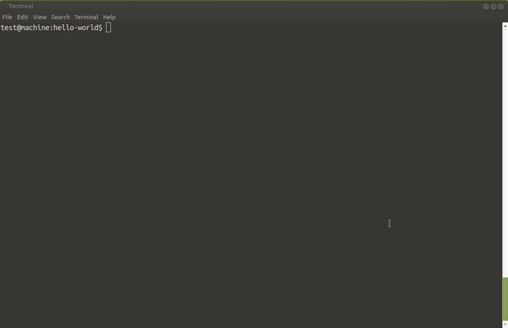

# Remote Git Repo Opener

- [Usage](#usage)
  - [Examples](#examples)
- [Installation](#installation)
- [Features](#features)

The `repo` script opens the Git repository you are currently working on in **Azure Repos** or **GitHub** from the command line on Linux.

It's that simple! But it saves you clicking and pushing around the mouse when you work with several Git repositories.



## Usage

```

$ repo --help

Usage: repo [-h] [-v] [ FILE | - ]
Opens the FILE of a Git repo (or the root of the repo if no file is given) "remotely" in the browser.
If "-" is used as a FILE, the first line of stdin is read and used as FILE.

Available options:

-h, --help        Print this help and exit
-v, --verbose     Print diagnostic messages

-y, --history     Open the history view for FILE
-p, --print-only  Only print the URL that would be opened in a browser


```

### Examples

```bash
# Opens main page of "my-azure-repo" on dev.azure.com in your default web browser
~/dev/my-azure-repo/$ repo
```

```bash
# Opens the "docs" folder view
~/dev/my-azure-repo/docs$ repo .
```

```bash
# Opens the file view of "README.md"
~/dev/my-azure-repo/$ repo README.md
```

```bash
# Opens the file history view of "README.md"
~/dev/my-github-repo/$ repo -y README.md
```

## Installation

- [Download](https://github.com/ctjdr/repo-cli/releases/download/1.0.0-1/repo-cli_1.0.0-1.deb) and install the DEB file to install on Debian/Ubuntu:
    ```bash
    $ dpkg --install 
    ``` 

    or

- [Download](https://github.com/ctjdr/repo-cli/releases/download/1.0.0-1/repo-cli_1.0.0-1.deb) the script into a folder that is in `$PATH`.

## Features

- Works for GitHub and Azure DevOps Repos
- Open history (aka 'commits') view for a file or directory
- Open branch currently checked out
- Print the URL that would be opened to standard out
